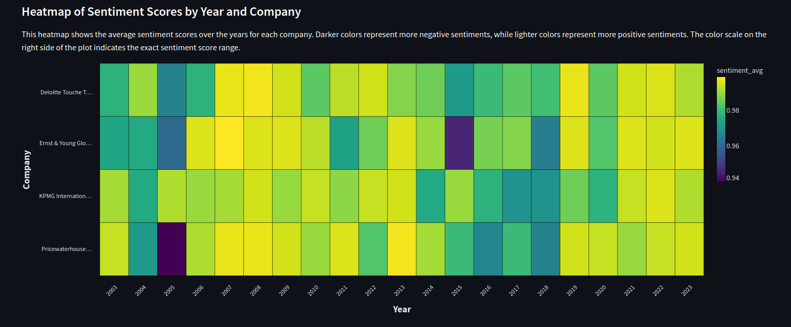
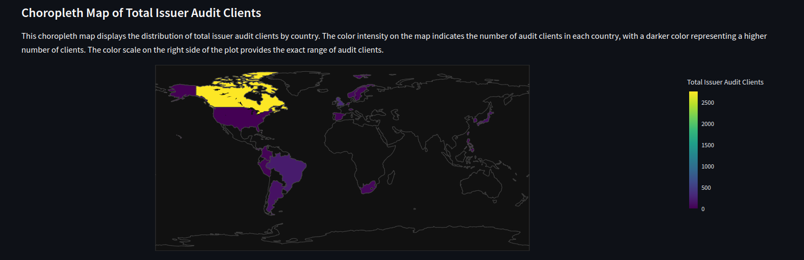
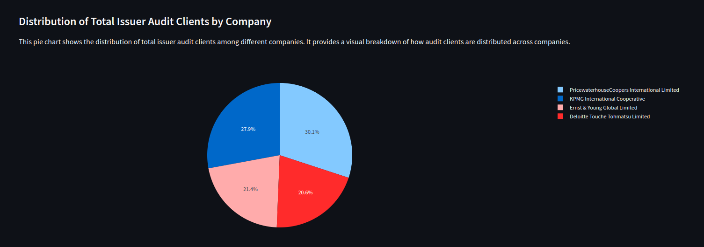
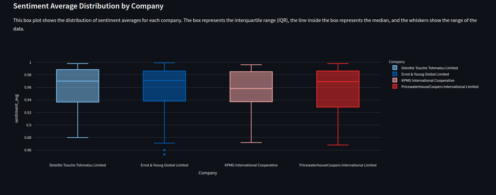
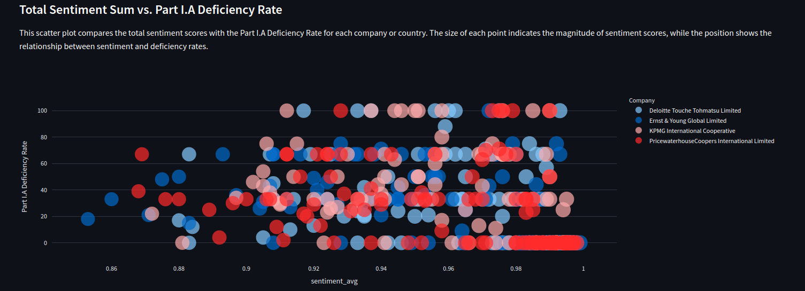

# PCAOB Inspection Project

## Overview

The **PCAOB (Public Company Accounting Oversight Board) Inspection Project** is a comprehensive data analysis initiative focused on extracting, transforming, and visualizing data from PCAOB inspection reports. The **PCAOB (Public Company Accounting Oversight Board)** issues inspection reports that summarize the results of their inspections of registered public accounting firms. The PCAOB's inspections assess a firm's compliance with laws, rules, and professional standards, as well as their quality control system and audit work for public companies and broker-dealers. The PCAOB's goal is to improve audit quality and communicate their findings. The primary goal of this project is to provide insights into the inspection data, including trends, patterns, and key metrics, through interactive dashboards and visualizations. In this project, we perform **sentiment analysis** on PCAOB reports to gauge the overall tone and sentiment of the findings. Additionally, we explore correlations between sentiment scores and identified deficiencies.

## Features
- **Data Extraction**: Automated web scraping to extract PCAOB inspection data from multiple web pages.
- **Data Transformation**: Processing and cleaning of extracted data to ensure accuracy and consistency.
- **Data Visualization**: Interactive dashboards and visualizations using tools like Streamlit, showcasing key insights from the inspection data.
- **Sentiment Analysis**: Analyzing the sentiment of the inspection reports to understand the overall tone of the findings.
- **Geographical Analysis**: Visualizing inspection data geographically to identify regional patterns and trends.

## Project Structure
The project is organized into the following main components:

- `extracting_pdf_links.ipynb`: Jupyter notebook for extracting PDF links from the PCAOB website.
- `data_transformation.ipynb`: Jupyter notebook for transforming and cleaning the extracted data.
- `dashboard.py`: Python script for generating the final interactive dashboard using Streamlit.

## Installation
To run this project locally, follow these steps:

1. Clone the repository:

    '''bash
    Copy code
    git clone https://github.com/ehi58/pcaob-inspection-project.git
    cd pcaob-inspection-project
    Install dependencies: Make sure you have Python 3.x installed. Then install the required Python packages:

    '''bash
    Copy code
    pip install -r requirements.txt
    Run the Jupyter notebooks: Start Jupyter Notebook or Jupyter Lab and run the extracting_pdf_links.ipynb and data_transformation.ipynb notebooks to extract and transform the data.

2. Launch the dashboard: Run the following command to start the Streamlit dashboard:

    '''bash
    Copy code
    streamlit run dashboard.py

## Usage
1. Data Extraction
- The extracting_pdf_links.ipynb notebook automates the process of extracting PDF links from the PCAOB website. The data is then saved locally for further processing.

2. Data Transformation
- The data_transformation.ipynb notebook handles the transformation and cleaning of the extracted data. This step ensures that the data is ready for analysis and visualization.

3. Data Visualization
- The dashboard.py script generates an interactive dashboard using Streamlit. This dashboard includes various visualizations, such as heatmaps, choropleth maps, sentiment analysis plots, and more.

### Key Visualizations
Here are some examples of the data visualizations included in the project:

1. Heatmap of Inspection Results:
    - Description: This heatmap shows the average sentiment scores over the years for each company.
    - Image:
    

2. Choropleth Map of Inspections by Region:
    - Description: The choropleth map displays the distribution of total issuer audit clients by country, highlighting areas with the most frequent issuer audit clients.
    - Image:
    

3. Sentiment Analysis of Inspection Reports:
    - Description: Sentiment analysis plot that shows the overall tone of the inspection reports, with classifications such as positive, neutral, or negative.
    - Image:incoming standby
    //<>

4. Pie Chart of Deficiencies:
    - Description: The pie chart provides a visual breakdown of the types of deficiencies found during PCAOB inspections, making it easier to see the proportions of different categories.
    - Image:
    

5. Box Plot of Sentiment Scores:
    - Description: This box plot illustrates the distribution of sentiment scores across different firms, highlighting the spread and identifying any outliers in the data.
    - Image:
    

6. Scatter Plot of Sentiment Scores vs Deficiencies:
    - Description: This scatter plot shows the relationship between sentiment scores and the number of deficiencies, helping to identify any potential correlations.
    - Image:
    

## Conclusion
The **PCAOB Inspection Project** provides valuable insights into the patterns and trends in PCAOB inspections. By leveraging data extraction, transformation, and visualization techniques, this project makes it easier to understand the impact of PCAOB findings across the industry.

## License
This project is licensed under the MIT License. See the LICENSE file for details.

## Acknowledgments
Thanks to the **Public Company Accounting Oversight Board (PCAOB)** for providing the inspection data used in this project.